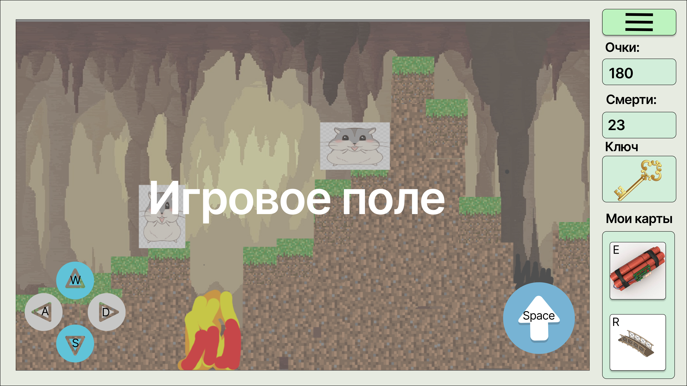
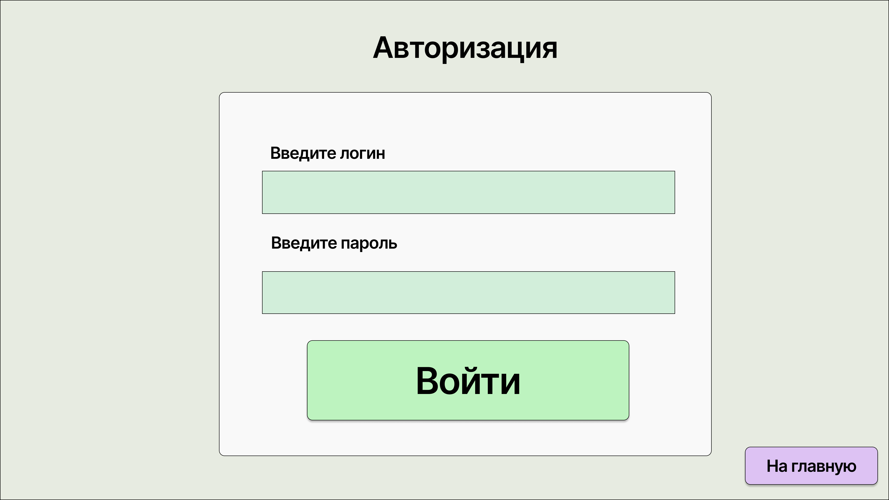
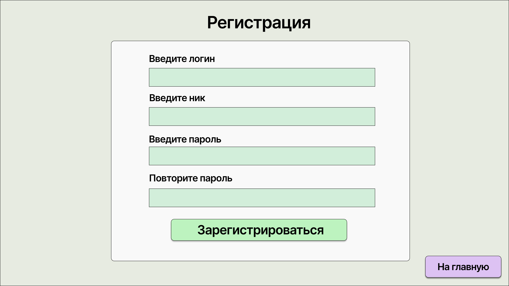

## Техническое задание к игре Lemmingstone
### Содержание:
1. Описание проекта
- 1.1. Термины и определения 
- 1.2. Описание приложения 
- 1.3. Лор 
2. Игровой процесс
- 2.1. Клаасы леммингов
- 2.1.1. Класс «Силач»
- 2.1.2. Класс «Разведчик»
- 2.2. Карточки способностей
- 2.2.1. Карточка «Лестница»
- 2.2.2. Карточка «Лопата»
- 2.2.3. Карточка «Тротил»
- 2.2.4. Карточка «Фермер»
- 2.3 Получение и трата очков
- 2.3.1. Завершение уровня
- 2.3.2. Особые задания
- 2.3.3. Трата очков
- 2.4. Ключ и врата
- 2.5. Возрождение
- 2.6. Магазин
- 2.7 Босс
- 2.7.1. Время появление
- 2.7.2. Типы атак
- 2.7.3. Характеристики босса
- 2.7.4. Внешний вид босса
3. Функциональные требования экранов
- 3.1. Игровая сцена на компьютерах
- 3.2. Игровая сцена на мобильных устройствах
- 3.3. Экран начала игры
- 3.4. Экран авторизации
- 3.5. Экран регистрации
- 3.6. Экран выбора класса
- 3.7. Экран настройки
- 3.8. Экран возрождения
- 3.9. Экран внутриигровых настроек
- 3.10. Игровая сцена класса «Силач»
- 3.11. Игровая сцена класса «Разведчик»
- 3.12. Экран рейтинга
4. Функциональность приложения
- 4.1 Регистрация
- 4.2. Авторизация
### 1. Описание проекта
#### 1.1. Термины и определения
- **Игрок** – живой человек.
- **Сцена** – игровое пространство, отображаемое на устройствах.
- **Лемминг** – сущность игрока, представляет собой грызуна, обладающего разными классами и способностью носить карточки.
- **Класс** – особое разделение сущностей игроков, от которого в дальнейшем будет зависеть игровой процесс и задачи игрока.
- **Карта способностей** – особый навык лемминга, выдающийся рандомно игроку в начале, дающий леммингу особые навыки.
- **Возрождение** – респаун игрока после смерти.
- **Труп** – тело лемминга, оставшееся на месте смерти игрока.
- **Рейтинг** – экран, где будут отображаться топ игроков сортируемые по количеству набранных очков.
#### 1.2. Описание приложения
- Суть проекта заключается в создании пиксельной 2D-стратегии с элементами выживания, цель которой найти на карте ключ и добраться до врат, для перехода на следующий уровень.
#### 1.3. Лор
- После катаклизма мир изменился до неузнаваемости. Многие животные погибли, а выжившие мутировали в страшных монстров, установив новый порядок на поверхности. Чтобы спасти свой вид от опасности, лемминги, оказавшиеся слишком уязвимыми для нового мира, ушли под землю. Однако даже в подземном убежище им предстоит столкнуться с трудностями - выживать в окружении хищников, которые также спустились в поисках убежища и пропитания.
### 2. Игровой процесс
#### 2.1. Классы леммингов
#### 2.1.1. Класс «Силач»
- Особый класс, обладает способностью носить две карточки способностей.
- Внешне является массивным и высоким леммингом.
- Первичные характеристики: Хп – 150; Скорость - 1
#### 2.1.2. Класс «Разведчик»
- Особый класс, обладает способностью носить одну карточки способности.
- Внешне является невысоким и худым леммингом.
- Первичные характеристики: Хп – 50; Скорость - 4
#### 2.2. Карточки способностей
#### 2.2.1. Карточка «Лестница»
- Особая способность, позволяющая леммингу ставить лестницу, с помощью которой он может преодолевать препятствия. Лестницу можно вращать и ставить под нужным градусом.
- Внешность карточки: карта, в верхней части находится название, под ним квадрат с отступом от границ, внутри которого находится изображение лестницы, в нижней части карты находится описание
#### 2.2.2. Карточка «Лопата»
- Особая способность, позволяющая леммингу копать разрушаемые блоки вокруг себя в ограниченном радиусе.
- Внешность карточки: карта, в верхней части находится название, под ним квадрат с отступом от границ, внутри которого находится изображение лопаты, в нижней части карты находится описание
#### 2.2.3. Карточка «Тротил»
- Особая способность, позволяющая леммингу кидать тротил, который взрывает разрушаемые блоки вокруг себя в определенном радиусе, может наносить урон по леммингу, если тот находится в зоне взрыва.
- Урон по леммингу при попадании – 75
- Время взрыва – 3 секунды после использования карточки 
- Внешность карточки: карта, в верхней части находится название, под ним квадрат с отступом от границ, внутри которого находится изображение тротил, в нижней части карты находится описание
#### 2.2.4. Карточка «Фермер»
- Особая способность, позволяющая леммингу, садить росток, который по истечению определенного времени, вырастает в дерево, его рост в высь не ограничен. Так же дерево является особой постройкой, которая способна преграждать путь боссу. После нескольких ударов по нему боссом, оно ломается.
- Время роста дерева занимает 30 секунд
- Внешность карточки: карта, в верхней части находится название, под ним квадрат с отступом от границ, внутри которого находится изображение дерева, в нижней части карты находится описание.
#### 2.3. Получение очков
- **Очки** – особая награда, получаемая леммингами за прохождение уровня (только теми, что находятся на этом уровне) или выполнение особых заданий. Ограничения по получению очков нет.
#### 2.3.1. Завершение уровня
- За прохождения уровня леммингам дается 10 очков.
#### 2.3.2. Особые задания
- Под особым задание подразумевается сбор золотых монет, появляющихся на кроне дерева, посаженного игроком с карточкой «Фермер» (пункт 2.2.4).
- Собирать золотые монеты может любой из игроков, очки за это будет начисляться только тому, кто подобрал золотую монету.
- Одна золотая монета равняется 2 очкам.
#### 2.3.3. Трата очков
- Очки тратятся на моментальное возрождение игрока (пункт 2.5.).
#### 2.4. Ключ и врата
- **Ключ** – особый предмет, появляющийся на карте, необходимый для перехода на следующий уровень.
- **Врата** – объект, для перехода на следующий уровень, автоматически открываются при нахождении игроком ключа.
- Ключ появляется рандомно на карте.
- Врата появляются в противоположном углу карты от точки появления игроков.
#### 2.5. Возрождение
- После смерти игрок может возродиться автоматически по истечению определенного времени или же потратив n-ое количество очков опыта.
- Автоматическое воскрешение происходит по прошествию 30 секунд.
- Количество очков для моментального воскрешения ровно 15.
- Игрок возрождается в начале уровня, на котором он умер.
#### 2.6. Магазин
- Магазин – особый объект, спавнится рандомно на карте, в котором игроки могут за очки поменять свои карточки способностей.
- В магазине появляются рандомно три карточки способностей.
- Стоимость замены – 12 очков 
#### 2.7 Босс 
- Босс – тип врага, который будет появляться на уровне, через определенный промежуток времени, и стремящийся убить всех леммингов на карте.
#### 2.7.1. Время появление
- Босс появляется на карте спустя 4 минуты после начала уровня.
- Спавнится в начале уровня.
#### 2.7.2. Типы атак
- Атака вперед – наносит урон и разрушает блоки перед собой в определенном радиусе.
- Атака вверх – совершает небольшой прыжок и наносит урон над собой в определенном радиусе.
- Атака в прыжке – прыгает вверх после чего падает на землю и наносит урон под собой, способен ломать блоки под собой.
#### 2.7.3. Характеристики босса
- Хп – бесконечное
- Скорость – 1
- Урон от атак - 20000
#### 2.7.4. Внешний вид босса
- Высокий и худощавый песец, имеет повязку на одном глазу, все тело в шрамах.
### 3. Функциональные требования экранов
- Для обеспечения оптимального игрового опыта размер экрана может находиться в диапазоне от 1024x768 пикселей до 1920x1080 пикселей.

#### 3.1. Игровая сцена на компьютерах
- Передвижение - w,a,s,d
- Прыжок - space
- Карточка способности - e,r (e - для класса разведчик)
#### 3.2. Игровая сцена на мобильных устройствах
- Передвижение и прыжок - джойстик
- Карточка способности - нажатие на карточку в правом нижнем углу
#### 3.3. Экран начала игры

При входе в приложение пользователь видит экран начала игры. На нем присутствуют следующие элементы:
- Кнопка «Авторизации»
- Кнопка «Регистрации»
- Кнопка «Настройки»
#### 3.4. Экран авторизации

На данный экран пользователь попадает при нажатии на кнопку "Авторизация". На нем присутствуют следующие элементы:
- Поле ввода логина
- Поле ввода пароля
- Кнопка «Войти»
- Кнопка «На главную»
#### 3.5. Экран регистрации

На данный экран пользователь попадает при нажатии на кнопку "Регистрация". На нем присутствуют следующие элементы:
- Поле ввода логина
- Поле ввода ника
- Поле ввода пароля
- Поле повторного ввода пароля
- Кнопка «Зарегистрироваться»
- Кнопка «На главную»
#### 3.6. Экран выбора класса

На данный экран пользователь попадает после завершения регистрации. На нем присутствуют следующие элементы:
- Кнопка «Играть», пока игрок не выберет класс является неактивной и при нажатии ничего не происходит.
- Кнопка выбора класса «Разведчик»
- Кнопка выбора класса «Силач»
- Кнопка «На главную»
#### 3.7. Экран настройки

На данный экран пользователь попадает при нажатии на кнопку "Настройки". На нем присутствуют следующие элементы:
- Поле изменения ника
- Поле изменения пароля
- Поле повторного ввода нового пароля
- Поле с ID игрока
- Поле с действующим ником
- Кнопка «Сохранить»
- Кнопка «На главную»
#### 3.8. Экран возрождения

- Кнопка "Воскреснуть"
#### 3.9. Гамбургер меню

На данный экран пользователь попадает при нажатии на кнопку "Настройки" во время игры. На нем присутствуют следующие элементы:
- Кнопка «Продолжить игру»
- Кнопка «Настройки»
- Кнопка «Выйти из игры»
#### 3.10. Игровая сцена класса «Силач»

На данный экран пользователь попадает при условии, что был выбран класс «Силач». На нем присутствуют следующие элементы:
- Поле с количеством очков
- Поле с количеством смертей 
- Поле «Ключ», пока игроки не нашли ключ поле отображается пустым.
- Поле с карточками игрока
- Кнопка «Настройки»
- Кнопка прыжок (для мобильных устройств)
- Джойстик (для мобильных устройств)
#### 3.11. Игровая сцена класса «Разведчик»
#### 3.12. Экран рейтинга

- Кнопка «На главную»
### 4. Функциональность приложения
#### 4.1.	Регистрация
Для работы с приложением необходимо пройти регистрацию. Форма регистрации содержит следующие поля: 
- Логин. Тип данных - строка, не менее чем из 6 и не более 15 символов, обязательно для заполнения. Используемые символы: латинские символы рхнего регистра (A-Z), латинские символы нижнего регистра (a-z), цифры (0-9).
- Никнейм. Тип данных - строка, не менее чем из 3 и не более 16 символов, обязательно для заполнения. Используемые символы: латинские символы рхнего регистра (A-Z), латинские символы нижнего регистра (a-z), кириллические символы верхнего регистра (А-Я), кириллические символы нижнего гистра (а-я), цифры (0-9).
- Пароль. Тип данных - строка, не менее 8 и не более 20 символов, обязательно для заполнения. Используемые символы: латинские символы рхнего регистра (A-Z), латинские символы нижнего регистра (a-z), цифры (0-9).
- Повтор пароля. Тип данных - строка, обязательно для заполнения.
#### 4.2. Авторизация
После регистрации пользователь проходит автоматическую авторизацию в Приложении. Пользователю необходимо проходить авторизацию после каждого хода в игру. Форма авторизации содержит следующие поля: 
- Логин. Тип данных - строка, не менее чем из 6 и не более 15 символов, обязательно для заполнения.
- Пароль. Тип данных - строка, не менее 8 и не более 20 символов, обязательно для заполнения.

